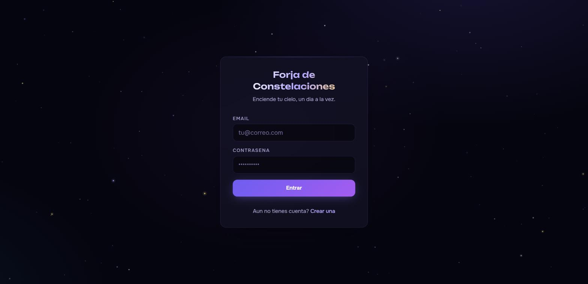
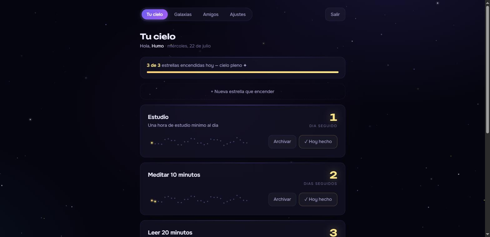
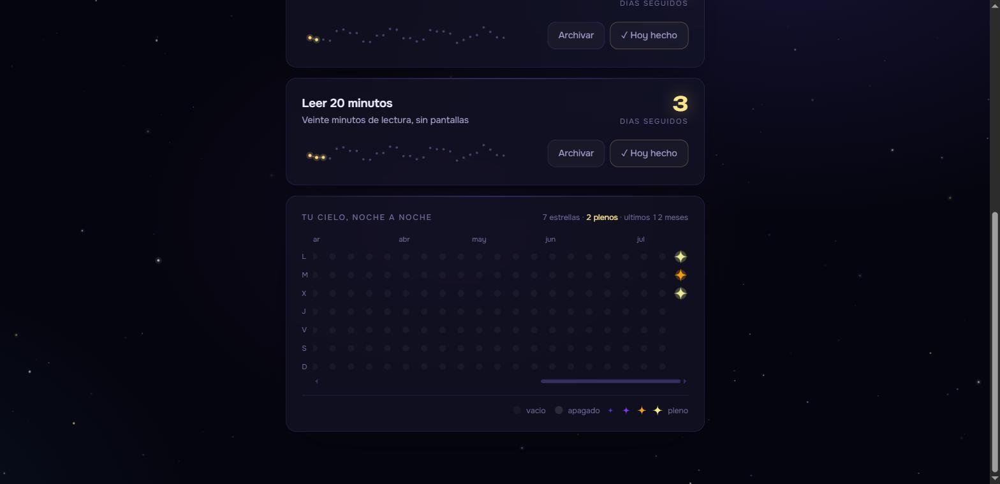
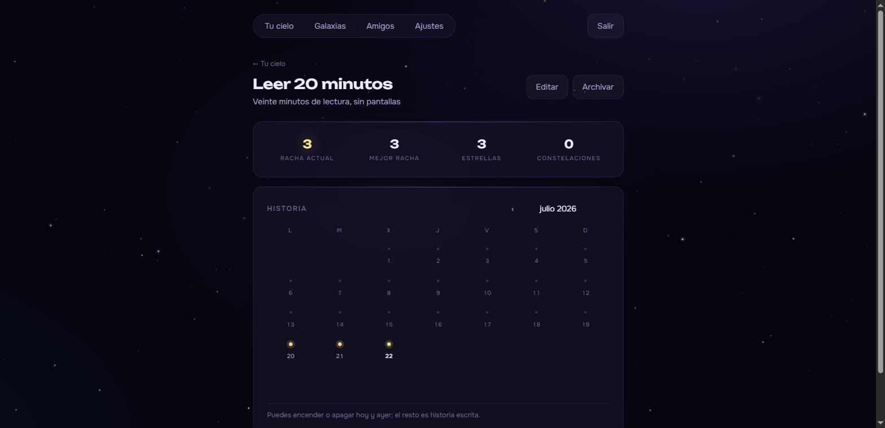
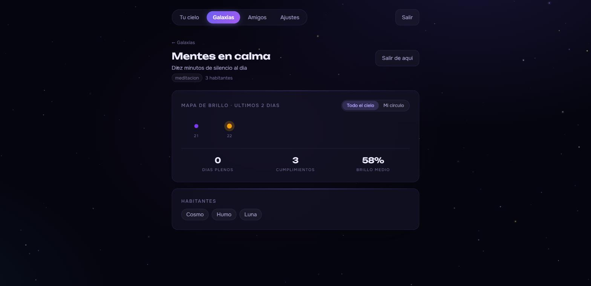
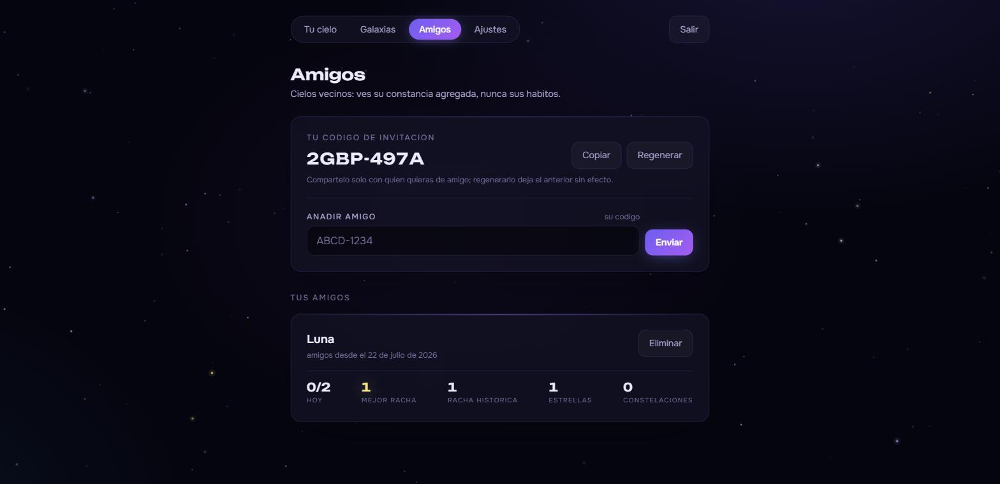

# Forja de Constelaciones — Frontend

SPA en React para el backend de [habit-constellations-backend](https://github.com/BecerraHector/habit-constellations-backend):
un registro de hábitos donde cada racha enciende estrellas y cada 30 días completa una constelación.

## Estado actual — versión temprana

Interfaz funcional de punta a punta contra la API real, con datos de demostración. El
diseño es un sistema propio —cartografía celeste sobre fondo de vacío, oro reservado a lo
ganado, y la misma rampa de brillo que usa el backend— construido con tokens de Tailwind 4.

**Entrar.** Acceso y registro, con el frenado de intentos del backend reflejado en el
mensaje de error.



**Tu cielo.** El panel diario: resumen de estrellas encendidas hoy, cada hábito con su
racha y la constelación del ciclo dibujándose punto a punto. Marcar el día enciende la
estrella con una pequeña ceremonia (que respeta `prefers-reduced-motion`).



**Noche a noche.** El mapa de calor de los últimos 12 meses con todos los hábitos
condensados en un nivel de brillo por día. La forma se gana: las noches vacías y los días
fallados son puntos discretos, y la estrella de cuatro puntas solo aparece donde se
cumplió, creciendo hasta el pleno dorado que titila.



**Detalle de un hábito.** Historia en calendario mensual, estadísticas en vivo y edición
en línea. Solo hoy y ayer son interactivos —la misma ventana de repaso que impone el
backend—, el resto es historia escrita.



**Galaxias.** Constelaciones compartidas: el brillo de cada día es proporcional a cuánta
gente cumplió, con el conmutador «Todo el cielo / Mi círculo» para acotar el mapa a los
amigos. Dentro solo se ven nombres visibles y cumplimiento, nada más.



**Amigos.** Código de invitación personal y panel de cifras agregadas: nunca los nombres
de los hábitos ajenos.



Queda pendiente el despliegue (anotado en el `PENDIENTES.md` del backend); las capturas
son de la instancia local de desarrollo.

## Stack

- **React 19 + TypeScript + Vite**
- **Tailwind CSS 4** con tokens propios (tema cósmico oscuro)
- **TanStack Query** para el estado de servidor; sesión en Context
- **react-router-dom** con guard de rutas privadas

## Desarrollo

Requiere el backend corriendo en `localhost:8080` (Vite hace proxy de `/api`, sin CORS en desarrollo):

```bash
npm install
npm run dev        # http://localhost:5173
```

```bash
npm run build      # tsc + vite build
npm run lint       # oxlint
```

En producción, `VITE_API_URL` apunta al backend real (ver `.env.example`).

## Autenticación

El access token (JWT, 30 min) vive solo en memoria; el refresh token (opaco, rotatorio)
en `localStorage`. Ante un 401 el cliente refresca una única vez —con una sola promesa
compartida aunque haya peticiones concurrentes— y reintenta; si el refresco falla, la
sesión se cierra. Los endpoints públicos de auth no pasan por ese reintento.
